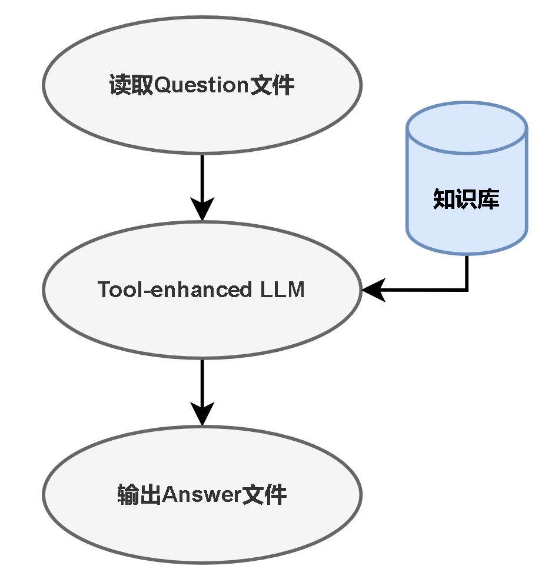

# LLM4Analog
## Background
Contemporary mainstream large language models possess excellent analytical, explanatory, and logical reasoning abilities. However, when it comes to more complex tasks such as circuit netlist analysis and design, as well as deriving and calculating circuit-related formulas, current large language models may struggle to perform these tasks effectively.

An agent can enhance a model's ability in the field of circuit design without the need for extensive resource-consuming training. It can integrate a set of tools and libraries to create complex natural language processing workflows that can combine various data sources, tools, and external services. The integration of Retrieval-Augmented Generation (RAG) and computational tools can significantly improve the performance of large language models in the domain of circuit design simulation.
## Project Description
This design involves constructing an Agent framework to answer questions related to the design of passive filter circuits composed of resistors (R), inductors (L), and capacitors (C). For a specific type of filter, two files are provided to describe the circuit (including circuit structure, function, transfer function, and performance metrics) and the netlist, totaling 16 files. We utilize these knowledge bases to enhance the capabilities of the large model in order to answer three specific types of questions and return the output in the specified format.

### type1: netlist generation
input：str
```
[
“Give the netlist of parallel RLC bandpass filter with a R=1.5kOhms resistor and a L=7mH inductor and a C=5.2nF capacitor”
]
```
output：str netlist
```
Vin in 0 AC 1
R in out 1.5k
C out 0 5.2n
L out 0 7m
.END
```
### type2: cutoff frequency calculation
input：str
```
[
    “Given a R=1.5kOhms resistor, a L=7mH inductor and a C=5.2nF capacitor, calculate the cutoff frequency of parallel RLC bandpass filter”
]
```
output：dict
```
{
"omega_c1": "1.02e+05",
"omega_c2": "2.30e+05"
}
```
### type3: circuit parameter calculation
input：str
```
[
    “Design a parallel RLC bandpass filter with \\beta=129krad/s \\omega_0=166krad/s , currently I have a R=1.5kOhms resistor, a L=7mH inductor, tell me which capacitor value should I choose, the C is in nF units”
]
```
output：dict
```
{
"C": "5.184248180328889e-9"
}
```

This project uses the GLM-4-0520 model provided by Zhipu AI, with the model's API interface already included in the code. The question.json file contains the test questions, and the output files for each question are located in the output folder.
## Detailed Design and Functionality
### overall framework

### RAG Usage
It uses a custom-made knowledge indexer for knowledge base searching!

For cutoff frequency and circuit parameter calculation, it uses RAG to help the prompt.

This RAG does not use semantic things such as TF-IDF, etc.
Instead, it just reads the circuit netlists and descriptions in a bare-metal way, and divide into
parts that are possibly useful for our tasks.
### Tool Usage
It uses Python REPL if the question requires calculation.

In our program, the LLM does not calculate values. Instead, its output information contains
expressions that are available for the program executing in the Python REPL.

## Directory Structure
- `question.json` - the questions to be answered
- `output` - the directory to save output files
- `knowledge_base` - knowledge base for RAG-enhanced LLM
- `src` - programs

## Requirements
run `conda create -n llm4analog python=3.10` to create a new environment
run `conda activate llm4analog` to activate the environment
run `pip install -r requirements.txt` to install the required packages

## How to Run?

```bash
export PYTHONPATH=.
conda activate llm4analog
python src/main.py
```
You can also see the dialogues on the screen.
